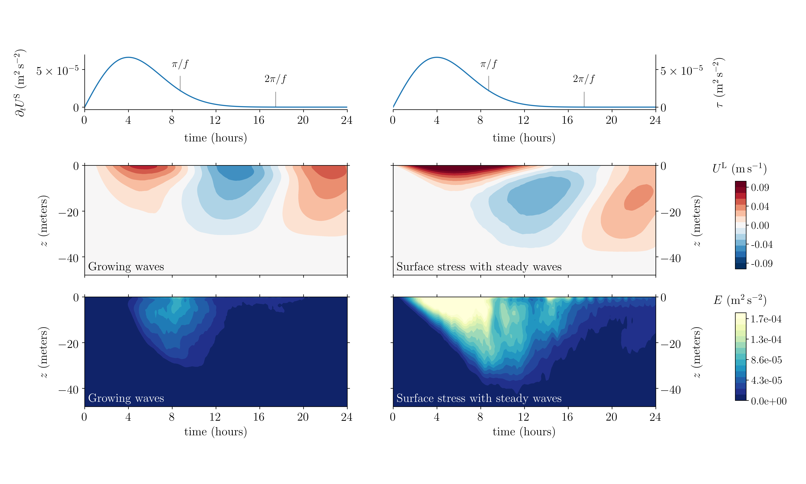

# WaveTransmittedTurbulence

Currents and turbulence beneath growing surface gravity waves.


<p align="center">
<i> Figure 1: Turbulence and currents transmitted to the ocean during the idealized, forced growth of a surface gravity wave field in the absence of turbulent surface stresses, as modeled by a large eddy simulation. The left panel shows vertical velocity contours normalized by the maximum effective friction velocity, while the right panel shows horizontally-averaged currents after 1/8th an inertial period and after a full inertial period. The initial boundary layer depth is around 8 meters.</i>
</p>



<p align="center">
<i> Figure 3: Vertical velocity contours in simulations of ocean surface boundary layer turbulence driven by wind both without waves (left) and beneath steady waves (center and right). The center panel reproduces results from McWilliams et al., "Langmuir Turbulence in the Ocean," JFM (1997).</i>
</p>

This repository contains [Julia](https://julialang.org) code for reproducing the simulation data and plots in 

> Wagner et al., "Near inertial waves and turbulence driven by the growth of surface waves", _in prep_

All software in this repository is written in Julia. The plots are produced with `PyPlot`, a Julia wrapper around the python package `matplotlib`.

## Reproduction of scientific results

See [SIMULATIONS](/SIMULATIONS.md).

## A few details

From the root of this repository, the command

```
julia --project simulations/run_free_convection.jl
```

runs a simulation of free convection at a default low resolution of `32 x 32 x 32` and default surface buoyancy flux `1e-9 m^2 / s^3`, which will complete on some laptops in a matter of minutes.
The simulation will execute on a GPU if one is available.

Some parameters can be specified on the command line.
To see these, type

```
julia --project simulations/run_free_convection.jl --help
```

To make more substantial changes to the setup, edit the script `simulations/run_free_convection.jl` directly.


# Corresponding

Feel free to raise an issue here or contact the corresponding author (Greg) at `gregory.leclaire.wagner@gmail.com`.
